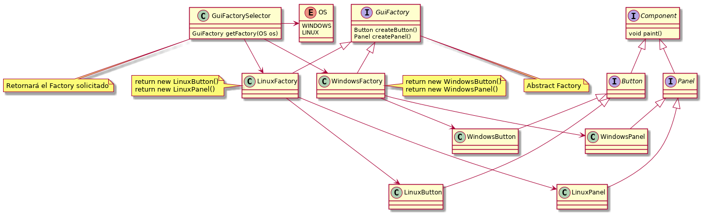
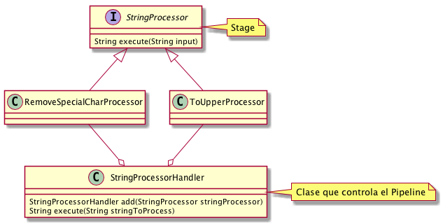

# Design Patterns Java

Este proyecto recoge los patrones de diseño más comunes
para explicarlos en español con ejemplos.

## Enlaces

- [refactoring.guru](https://refactoring.guru) (recomendado)
- [sourcemaking.com](https://sourcemaking.com/)
- [tutorialspoint.com](https://www.tutorialspoint.com/design_pattern)

## Comandos

`sudo apt install graphviz`: es necesario para usar [PlantUML](http://plantuml.com/)

`make uml`: crea la imagenes UML con [PlantUML](http://plantuml.com/)

`make clean`: limpia el proyecto

`make test`: corre todos las pruebas

## Patrones Creacionales

### [Abstract Factory](src/main/java/pattern/creational/abstractfactory)

Crea objetos de diferentes familias de clases. Es un Factory para crear Factories.

En el ejemplo se necesita crear objetos gráficos como: Button, Panel, Windows, TextField, entre otros.
Debido a que se desea que la aplicación sea multiplataforma, se crean Factories para crear los objetos
gráficos dependiendo de la plataforma (Windows, Linux).



Ejemplo de uso:

```
GuiFactory guiFactory = GuiFactorySelector.getFactory(OS.LINUX);

Button button = guiFactory.createButton(); // botón que funcionará solo en linux
button.paint();

Panel panel = guiFactory.createPanel(); // panel que funcionará solo en linux
panel.paint();
```

Este patrón puede ser usado cuando una solución debe funcionar con diferentes variantes de una familia de objetos.
Abstrae al desarrollador de la creación de los objetos, y solo tiene la responsabilidad de crear objetos asociados entre sí.

## Patrones de Comportamiento

### [Pipeline](src/main/java/pattern/behavioral/pipeline)

Consiste en un procesamiento en cadena de un elemento, donde cada paso de la cadena
genera una salida que será la entrada del paso consecutivo. 

En el ejemplo se necesita ejecutar varios procesos sobre un objeto String,
cada proceso tiene una única responsabilidad, como por ejemplo: remover caracteres
especiales o colocar en mayúsculas las letras. Se crea una clase principal (handler)
con la responsabilidad de ejecutar cada etapa en el orden asignado. 



Ejemplo de uso:

```
StringProcessorHandler stringProcessorHandler = new StringProcessorHandler();

String processedString = stringProcessorHandler
                .add(new RemoveSpecialCharProcessor())
                .add(new ToUpperProcessor())
                .execute("This$ is an uncl@ean+ed phr#aSe");

System.out.println(processedString); // Salida: THIS IS AN UNCLEANED PHRASE
```

Este patrón es muy útil cuando se tiene la necesidad de procesar un objeto (o dato)
en un orden con una serie de etapas bien definidas. Además, se puede usar
cuando la salida de una etapa es necesaria como entrada para otra.
Un paso puede ser o no un requisito previo para otro paso.