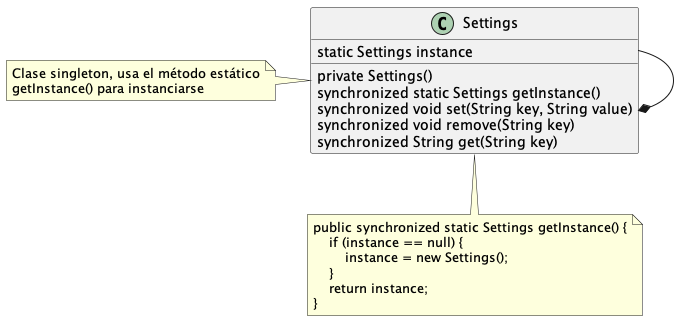
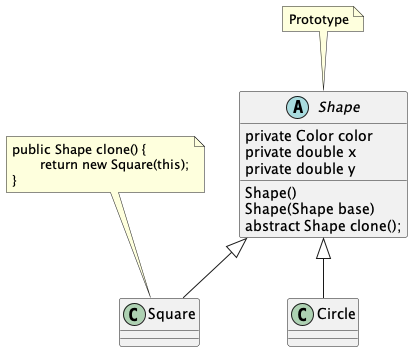
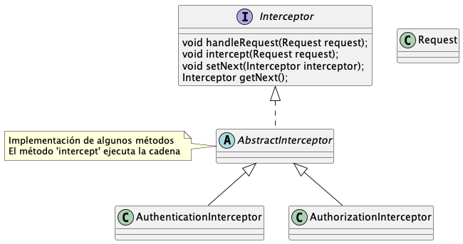
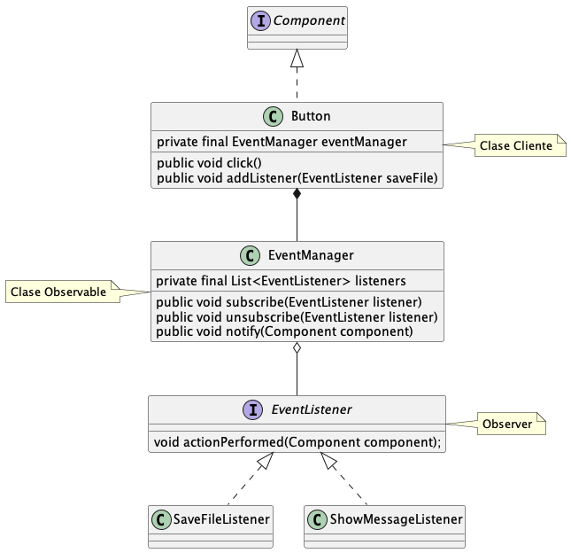
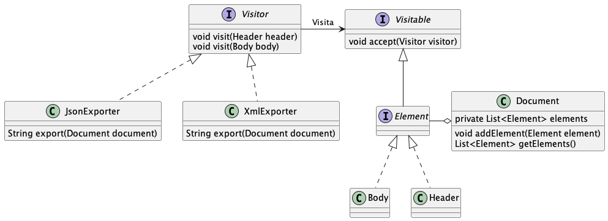
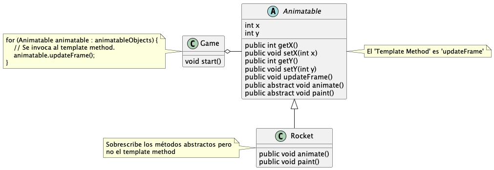
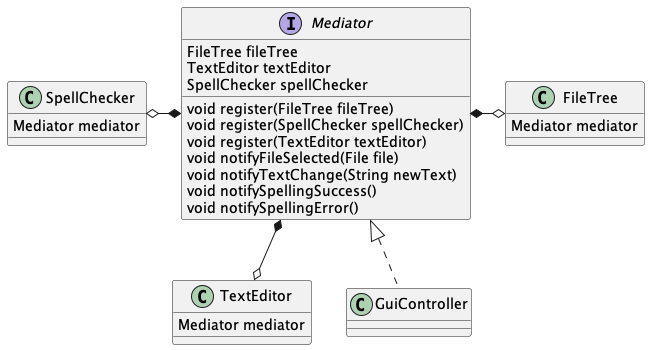
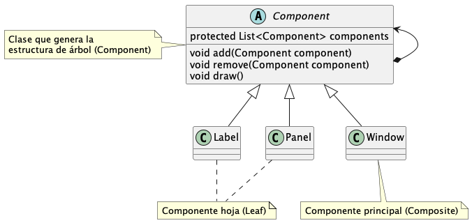
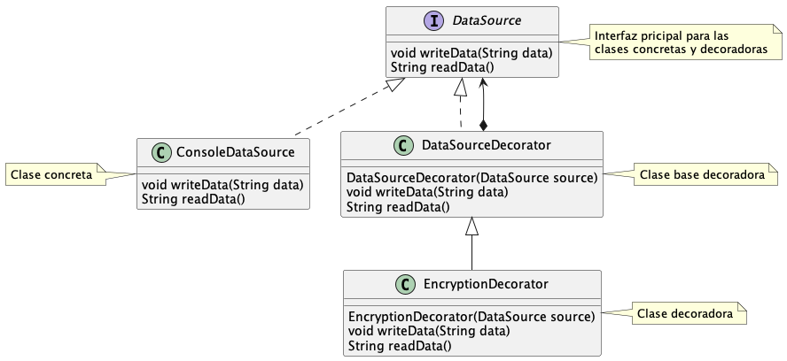

# Design Patterns in Java

Este proyecto recoge los patrones de diseño más comunes
para explicarlos en español con ejemplos.

## Índice

- [Enlaces](#enlaces)
- [Comandos](#comandos)
- [Patrones Creacionales](#patrones-creacionales)
    - [Factory Method](#factory-method)
    - [Abstract Factory](#abstract-factory)
    - [Singleton](#singleton)
    - [Builder](#builder)
    - [Prototype](#prototype)
- [Patrones de Comportamiento](#patrones-de-comportamiento)
    - [Pipeline](#pipeline)
    - [Chain Of Responsibility](#chain-of-responsibility)
    - [Strategy](#strategy)
    - [Memento](#memento)
    - [Observer](#observer)
    - [Visitor](#visitor)
    - [Template Method](#template-method)
    - [State](#state)
    - [Mediator](#mediator)
- [Patrones Estructurales](#patrones-estructurales)
    - [Adapter](#adapter)
    - [Bridge](#bridge)
    - [Composite](#composite)
    - [Decorator](#decorator)
    - [Facade](#facade)
    - [Proxy](#proxy)
    - [Flyweight](#flyweight)

## Enlaces

- [refactoring.guru](https://refactoring.guru)
- [mcdonaldland.info](http://www.mcdonaldland.info/files/designpatterns/designpatternscard.pdf)
- [java-design-patterns.com](http://java-design-patterns.com/patterns/)
- [wikipedia](https://es.wikipedia.org/wiki/Patr%C3%B3n_de_dise%C3%B1o)

## Comandos

`sudo apt install graphviz`: es necesario para usar [PlantUML](http://plantuml.com/)

`make uml`: crea la imagenes UML con [PlantUML](http://plantuml.com/)

`make uml file=builder`: crea la imagen del UML indicado en la variable `file`

`make clean`: limpia el proyecto

`make test`: corre todos las pruebas

## Patrones Creacionales


### [Factory Method](src/main/java/pattern/creational/factorymethod)

Crea objetos de una misma familia usando polimorfismo.
Permite abstraernos de como fue creado el objeto, generalmente
cuando es difícil de construir, no sabemos explícitamente cuál es la clase
a instanciar, o por último no es necesario saber cuál es la clase a instanciar.

En el ejemplo se asume que la aplicación le permite al usuario pagar
con efectivo o con tarjeta de crédito. Se crean dos clases de tipo pago,
cada una con un comportamiento diferente, se utiliza un factory para 
obtener la clase correcta según sea el caso.


Ejemplo de uso:

```
Payment payment = PaymentFactory.createPayment(PaymentType.CASH);

payment.doPayment(1000.50); // Salida: Paid with cash: 1000.50
```

El patrón generalmente es usado como un método estático.
Es muy útil para crear objetos rápidamente, o para crear objetos con distintos 
comportamientos pero en la misma familia.

### [Abstract Factory](src/main/java/pattern/creational/abstractfactory)

Crea objetos de diferentes familias de clases. Es un Factory para crear Factories.

En el ejemplo se necesita crear objetos gráficos como: Button, Panel, Windows, TextField, entre otros.
Debido a que se desea que la aplicación sea multiplataforma, se crean Factories para crear los objetos
gráficos dependiendo de la plataforma (Windows, Linux).


Ejemplo de uso:

```
GuiFactory guiFactory = GuiFactorySelector.getFactory(OS.LINUX);

Button button = guiFactory.createButton(); // Botón que funcionará solo en linux
button.paint(); // Salida: Linux Button

Panel panel = guiFactory.createPanel(); // Panel que funcionará solo en linux
panel.paint(); // Salida: Linux Panel
```

Este patrón puede ser usado cuando una solución debe funcionar con diferentes variantes de una familia de objetos.
Abstrae al desarrollador de la creación de los objetos, y solo tiene la responsabilidad de crear objetos asociados entre sí.

### [Singleton](src/main/java/pattern/creational/singleton)

Singleton es un patrón creacional que hace que exista solo una instancia para un tipo de dato.
Permite el acceso global a la instancia. Es usado cuando se necesita que compartir un recurso en todo la aplicación,
como por ejemplo la conexión a la base de datos. 

En el ejemplo se presenta un uso común, el acceso a configuraciones en la aplicación.
Generalmente las configuraciones son compartidas, y se necesita acceder a ellas desde cualquier
punto de la aplicación, además es necesario que estas se actualizen para toda la aplicación por igual.



Ejemplo de uso:

```
Settings settings = Settings.getInstance();

settings.set("db.name", "test");

System.out.println(Settings.getInstance().get("db.name")); // Se llama al método getInstance de nuevo. Salida: test
```

### [Builder](src/main/java/pattern/creational/builder)

Permite producir diferentes tipos y representaciones de un objeto utilizando el mismo proceso de construcción. 
El builder permite construir objetos complejos paso a paso.
Ayuda a que el código sea más legible. Y evita usar constructores, los 
cuales afectan a muchas clases cuando se cambia su firma.
También encapsula lógica especifica de construcción del objeto,
abstrayendo al usuario de este conocimiento.


Ejemplo de uso:

```
Person person = Person.builder()
                .firstName("Nikola")
                .lastName("Tesla")
                .build();

System.out.println(person);
```

### [Prototype](src/main/java/pattern/creational/prototype)

El prototipo es un patrón de diseño creacional 
que permite la clonación de objetos, incluso los más 
complejos, sin acoplarse a sus clases específicas.
Además, existen muchos objetos con atributos privados,
este patrón permite que se copien sin necesidad de acceder ellos.
El patrón Prototype está disponible en Java con una `Cloneable` interfaz.
Al clonar un objeto se debe tener cuidado de clonar sus atributos
que sean por referencia, ya que sino ambos clones apuntaran al mismo atributo. 

En el ejemplo asumimos que existen formas (shapes) que se dibujan en un canvas, y se quiere
dar la funcionalidad de copiar y pegar. Se utiliza este patrón
para poder clonar un shape y que su clon tenga todos sus atributos.



Ejemplo de uso:

```
Square square = new Square();
square.setWidth(100);
square.setHeight(100);
square.setX(20);
square.setY(20);
square.setColor(Color.BLACK);

System.out.printf("Original object: %s, new object: %s\n", square, square.clone()); // Salida ejemplo: Original object: pattern.creational.prototype.Square@39a054a5, new object: pattern.creational.prototype.Square@71bc1ae4
```

## Patrones de Comportamiento

### [Pipeline](src/main/java/pattern/behavioral/pipeline)

Consiste en un procesamiento en cadena de un elemento, donde cada paso de la cadena
genera una salida que será la entrada del paso consecutivo. 

En el ejemplo se necesita ejecutar varios procesos sobre un objeto String,
cada proceso tiene una única responsabilidad, como por ejemplo: remover caracteres
especiales o colocar en mayúsculas las letras. Se crea una clase principal (handler)
con la responsabilidad de ejecutar cada etapa en el orden asignado. 


Ejemplo de uso:

```
StringProcessorHandler stringProcessorHandler = new StringProcessorHandler();

String processedString = stringProcessorHandler
                .add(new RemoveSpecialCharProcessor())
                .add(new ToUpperProcessor())
                .execute("This$ is an uncl@ean+ed phr#aSe");

System.out.println(processedString); // Salida: THIS IS AN UNCLEANED PHRASE
```

Este patrón es muy útil cuando se tiene la necesidad de procesar un objeto (o dato)
en un orden con una serie de etapas bien definidas. Además, se puede usar
cuando la salida de una etapa es necesaria como entrada para otra.
Un paso puede ser o no un requisito previo para otro paso.

### [Chain Of Responsibility](src/main/java/pattern/behavioral/chainofresponsibility)

Consiste en un procesamiento en cadena de un elemento, cada eslabón de la cadena se denomina controlador (handler).
Al recibir una solicitud, cada controlador decide procesar la solicitud o pasarla al siguiente controlador de la cadena.

En el ejemplo refleja de manera muy básica el funcionamiento de los interceptores en
un servidor web. Cada interceptor recibe la petición hecha, y la procesa según se responsabilidad.
Se incluyeron dos interceptores, para autorización y autenticación respectivamente.



Ejemplo de uso:

```
AuthorizationInterceptor authorizationInterceptor = new AuthorizationInterceptor();

AuthenticationInterceptor authenticationInterceptor = new AuthenticationInterceptor();
authenticationInterceptor.setNext(authorizationInterceptor);

Request request = new Request();
request.setHeaders(Map.of("Access-Token", "123"));
request.setUrl("http://myweb.com/forbidden");

authenticationInterceptor.intercept(request); // SALIDA: EXCEPTION
```

### [Strategy](src/main/java/pattern/behavioral/strategy)

Permite definir una familia de algoritmos, encapsular cada uno y hacerlos intercambiables. El patrón permite que el algoritmo varíe independientemente de los clientes que lo utilizan.

Es útil cuando se tienes un objeto que debería poder hacer la misma tarea de muchas maneras diferentes. 
Esas tareas se pueden descomponer en clases de una misma familia.


Ejemplo de uso:

```
Compressor compressor = new Compressor();
compressor.setCompressionFormat(new ZipCompression());
	
compressor.compress(asList(new File("README.md"))); // Salida: Compressing [README.md] with zip format
```

### [Memento](src/main/java/pattern/behavioral/memento)

Patrón de diseño de comportamiento que permite capturar el estado interno de un objeto sin exponer su estructura interna, para que el objeto pueda regresar a este estado más adelante.

Es útil cuando necesitas hacer instantáneas de algunos objetos para restaurar su estado más tarde.
Permite producir copias completas del estado de un objeto y almacenarlas por separado del objeto. 


Ejemplo de uso:

```
History history = new History();
	
Console console = new Console();
	
console.setCommand("ls -la");
history.addSnapshot(console.generateSnapshot());
	
console.setCommand("cd ..");
history.addSnapshot(console.generateSnapshot());
	
console.restoreFromSnapshot(history.getSnapshot(0));
	
console.exec(); // Salida: Exec command: ls -la
```

### [Observer](src/main/java/pattern/behavioral/observer)

Observer es un patrón de diseño de comportamiento que permite definir
un mecanismo de suscripción para notificar a varios objetos
sobre cualquier evento que ocurra al objeto que están observando.

Es un patrón muy utilizado en las interfaces gráficas.

En el ejemplo cuando se hace clic en un botón se notifica a los observadores
'guardar archivo' y 'mostrar mensaje'.



Ejemplo de uso:

```
Button button = new Button();
button.addListener(new SaveFileListener());
button.addListener(new ShowMessageListener());
button.click(); // Se notificará a los observers
```

### [Visitor](src/main/java/pattern/behavioral/visitor)

Este patrón permite separar nuevos algoritmos o capacidades de los objetos en los que operan.

Es utilizado cuando es necesario agregar nuevas capacidades a objetos ya existentes,
sin agregar más complejidad a estos (o más líneas de código), sino moviendo dicha complejidad a otras clases.
También es utilizado cuando las nuevas operaciones a agregar no corresponden al dominio
a la clase original, ya que agregaría responsabilidades que no debería tener (principio de responsabilidad única).

Puede existir diferentes visitantes, uno para cada nueva capacidad que se desee agregar.

En el ejemplo es necesario agregar más lógica para exportar cada elemento,
su utiliza visitadores con la capacidad de exportar en diferentes formatos.



Ejemplo de uso:

```
Document document = new Document();
document.addElement(new Header());
document.addElement(new Body());

JsonExporter jsonExporter = new JsonExporter();
System.out.println(jsonExporter.export(document));

XmlExporter xmlExporter = new XmlExporter();
System.out.println(xmlExporter.export(document));
```

### [Template Method](src/main/java/pattern/behavioral/templatemethod)

El Método de plantilla es un patrón de diseño de 
comportamiento que define el esqueleto de un algoritmo en la superclase, 
pero permite que las subclases sobrescriban los pasos específicos 
del algoritmo sin cambiar su estructura.

En el ejemplo un objeto animatable sobrescribe solamente 'animate' y 'paint'.
El objeto cliente (Game) no llama directamente los métodos plantillas (pasos específicos),
sino que invoca 'updateFrame' (el Template Method).



Ejemplo de uso:

```java
/**
 * Un objeto 2D.
 */
public abstract class Animatable {
    private int x;
    private int y;

    public int getX() {
        return x;
    }

    public void setX(int x) {
        this.x = x;
    }

    public int getY() {
        return y;
    }

    public void setY(int y) {
        this.y = y;
    }

    /**
     * Este es el "Template Method".
     * Puede ser final para que no se herede.
     */
    public void updateFrame() {
        animate();
        paint();
    }

    public abstract void animate();

    public abstract void paint();
}
```

### [State](src/main/java/pattern/behavioral/state)

Este patrón permite separar es útil cuando se tiene un problema de máquina de estado finito,
y queremos separar la lógica de control de los estados (flujos de acciones) de 
las responsabilidades inherentes a la clase.
Permite que un objeto altere su comportamiento cuando cambia su estado interno. 

Este patrón evita el código espagueti, separando la lógica de los estados a clases externas,
además de evitar el uso de if anidados o switch.

En el ejemplo una clase servidor cambia a diferentes estados según acciones (o eventos),
estas invocan al estado actual para que dirija el flujo hacia otras acciones y estados.
Por ejemplo: el servidor inicia con estado 'cerrado', al invocar la acción iniciar cambia al estado 'escuchando'.


Ejemplo de uso:

```
Server server = new Server();
server.start();
server.connect();
server.disconnect();
server.stop();
```

### [Mediator](src/main/java/pattern/behavioral/mediator)

El patrón mediador permite reducir las dependencias caóticas entre los objetos.
El patrón restringe las comunicaciones directas entre los objetos 
y los obliga a colaborar sólo a través de un objeto mediador.

El mediador concentra el flujo de invocaciones de acciones y eventos.
Evita altas dependencias entre clases y código repetido.
El mediador conoce todos los objetos que desean comunicarse entre si.
Es especialmente utilizado para objetos heterogéneos (no es necesario que los colegas/colaboradores sean de la misma familia).
La responsabilidad del mediador tiene como alcance solamente dirigir el flujo de acciones entre objetos
más no directamente realizar las acciones por el mismo.



Ejemplo de uso:

```java
public class GuiController implements Mediator {
    private FileTree fileTree;
    private TextEditor textEditor;
    private SpellChecker spellChecker;

    @Override
    public void register(FileTree fileTree) {
        this.fileTree = fileTree;
    }

    @Override
    public void register(SpellChecker spellChecker) {
        this.spellChecker = spellChecker;
    }

    @Override
    public void register(TextEditor textEditor) {
        this.textEditor = textEditor;
    }

    @Override
    public void notifyFileSelected(File file) {
        textEditor.loadFile(file);
    }

    @Override
    public void notifyTextChange(String newText) {
        spellChecker.check(newText);
    }

    @Override
    public void notifySpellingSuccess() {
        fileTree.highlightSuccess();
    }

    @Override
    public void notifySpellingError() {
        fileTree.highlightError();
    }
}
```

## Patrones Estructurales

### [Adapter](src/main/java/pattern/structural/adapter)

Un adaptador envuelve (wraps) la lógica de un objeto, la cual no puede ser
alcanzada debido a interfaces incompatibles.

Es muy util cuando se quiere incluir una clase de terceros
a nuestra base de código pero, esta usa o retorna tipos de objetos no
compatibles con nuestra aplicación. Es necesario que el adaptador pertenezca (herede)
de una familia de clases.


Ejemplo de uso:

```
Fahrenheit fahrenheit = new Fahrenheit(98.6);

List<MetricTemperatureSystem> temperatureList = Arrays.asList(
    new Celsius(37),
    new CelsiusAdapter(fahrenheit)
);

System.out.println(fahrenheit); // Salida: 98.6° F
System.out.println(temperatureList); // Salida: [37.0° C, 37.0° C]
```

### [Bridge](src/main/java/pattern/structural/bridge)

Bridge es un patrón de diseño estructural que permite dividir una clase grande (o conjunto de clases) en dos jerarquías separadas 
(abstracción e implementación) que pueden desarrollarse independientemente una de la otra.

Se usa cuando un conjunto de clases que heredan del mismo padre crece en gran número
debido a que cada nuevo hijo debe combinar diferentes comportamientos (varias versiones del mismo).
Un ejemplo común son las formas y colores, si tenemos dos formas (cuadrado y circulo) y dos colores
(azul y rojo) entonces las combinaciones posibles son 4, a medida que vamos introduciendo formas o colores
las combinaciones crecerán mucho más. Por tanto, se separa parte de la lógica en otro conjunto de clases.


Ejemplo de uso:

```
InfoLogger infoLogger = new InfoLogger(new TerminalLoggerOutput());
infoLogger.log("message"); // Salida: INFO: message

ErrorLogger errorLogger = new ErrorLogger(new FileLoggerOutput("error.log"));
errorLogger.log("message"); // Salida: File: error.log ERROR: message
```

### [Composite](src/main/java/pattern/structural/composite)

Es un patrón de diseño estructural que le permite componer objetos en estructuras de árbol. 
Se usa en estructuras que necesitan composición anidada o recursiva. Un ejemplo puede ser la creación de interfaces
gráficas. 



Ejemplo de uso:

```
Window window = new Window("Main Window");

Panel firstPanel = new Panel("First Panel");
firstPanel.add(new Label("Label in First Panel"));
window.add(firstPanel);

Panel secondPanel = new Panel("Second Panel");
secondPanel.add(new Label("Label in Second Panel"));
window.add(secondPanel);

window.draw();
```

### [Decorator](src/main/java/pattern/structural/decorator)

Decorator es un patrón que permite agregar nuevos comportamientos 
a los objetos al colocarlos dentro de otros objetos envoltorios (wrappers) especiales.

El patrón [adapter](#adapter) cambia la interfaz de un objeto existente, 
mientras que el decorator mejora un objeto sin cambiar su interfaz. 
Además, admite la composición recursiva, 
que no es posible cuando se usa el adapter.



Ejemplo de uso:

```
ConsoleDataSource consoleDataSource = new ConsoleDataSource();
String data = consoleDataSource.readData();
consoleDataSource.writeData(data);

EncryptionDecorator encryptionDecorator = new EncryptionDecorator(consoleDataSource);
encryptionDecorator.writeData(data);
```

### [Facade](src/main/java/pattern/structural/facade)

Facade es un patrón de diseño estructural que proporciona una interfaz 
simplificada para una biblioteca, un framework o cualquier otro 
conjunto complejo de clases (subsistema). 

Permite separar y reemplazar de manera sencilla diferentes subsistemas. 
Disminuye el acoplamiento y dependencia de un conjunto de clases hacia otro.

En el ejemplo el cliente no necesita saber nada sobre la implementación del subsistema,
excepto la inicialización de la clase controladora para la base de datos requerida.
El cliente simplemente interactúa con las interfaces de la fachada en lugar de clases
específicas de la base de datos.
DriverManager actúa como una fachada para el subsistema subyacente.

Entre los ejemplos más conocidos tenemos JDBC y SLF4J.


Ejemplo de uso:

```
Class.forName("pattern.structural.facade.oracle.OracleJDBCDriver");
Connection connection = DriverManager.getConnection("oracle");
Statement statement = connection.createStatement();
statement.executeQuery("select * from employee");

Class.forName("pattern.structural.facade.mysql.MySQLJDBCDriver");
connection = DriverManager.getConnection("mysql");
statement = connection.createStatement();
statement.executeQuery("select * from employee");
```

### [Proxy](src/main/java/pattern/structural/proxy)

El proxy es un patrón de diseño estructural que permite 
proporcionar un sustituto para otro objeto. 
Un proxy controla el acceso al objeto original, 
lo que le permite realizar algo antes o después de que 
la solicitud llegue al objeto original.

Algunas diferencias con el patrón [decorator](#decorator) son:

- El decorator obtiene la referencia del objeto decorado (generalmente a través del constructor), mientras que proxy es responsable de hacerlo solo.
- Los proxy generalmente son utilizados por los frameworks para agregar seguridad o almacenamiento en caché.
- El decorator usualmente se usa para agregar un nuevo comportamiento a las clases antiguas o heredadas.


Ejemplo de uso:

```
Internet internet = new ProxyInternet();
try {
    internet.connectTo("google.com");
    internet.connectTo("forbidden.com");
} catch (Exception e) {
    System.out.println(e.getMessage());
}
```

### [Flyweight](src/main/java/pattern/structural/flyweight)

Flyweight es un patrón que permite optimizar el uso
de la RAM al compartir partes comunes de estado entre 
múltiples objetos en lugar de mantener todos los datos en cada objeto.

Sólo se separa la parte del objeto que pueden ser compartida entre otros objetos.


Ejemplo de uso:

```
TreeType type = TreeTypeFactory.getTreeType("Autumn Oak", Color.YELLOW);
Tree tree1 = new Tree(10, 10, type);
Tree tree2 = new Tree(20, 20, type);

tree1.draw();
tree2.draw();
```
