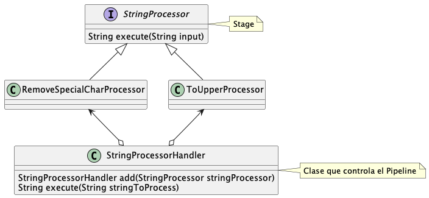
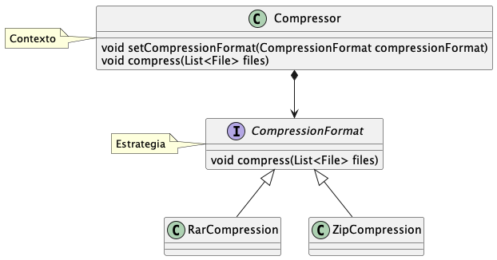
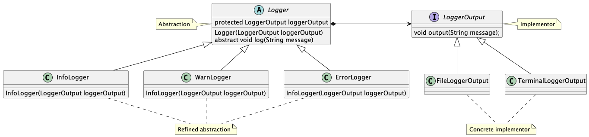

# Design Patterns in Java

Este proyecto recoge los patrones de diseño más comunes
para explicarlos en español con ejemplos.

## Índice

- [Enlaces](#enlaces)
- [Comandos](#comandos)
- [Patrones Creacionales](#patrones-creacionales)
    - [Factory Method](#factory-method)
    - [Abstract Factory](#abstract-factory)
    - [Singleton](#singleton)
    - [Builder](#builder)
    - [Prototype](#prototype)
- [Patrones de Comportamiento](#patrones-de-comportamiento)
    - [Pipeline](#pipeline)
    - [Strategy](#strategy)
    - [Memento](#memento)
- [Patrones Estructurales](#patrones-estructurales)
    - [Adapter](#adapter)
    - [Bridge](#bridge)
    - [Composite](#composite)

## Enlaces

- [refactoring.guru](https://refactoring.guru)
- [mcdonaldland.info](http://www.mcdonaldland.info/files/designpatterns/designpatternscard.pdf)
- [sourcemaking.com](https://sourcemaking.com/)
- [tutorialspoint.com](https://www.tutorialspoint.com/design_pattern)
- [java-design-patterns.com](http://java-design-patterns.com/patterns/)
- [wikipedia](https://es.wikipedia.org/wiki/Patr%C3%B3n_de_dise%C3%B1o)

## Comandos

`sudo apt install graphviz`: es necesario para usar [PlantUML](http://plantuml.com/)

`make uml`: crea la imagenes UML con [PlantUML](http://plantuml.com/)

`make uml file=builder`: crea la imagen del UML indicado en la variable `file`

`make clean`: limpia el proyecto

`make test`: corre todos las pruebas

## Patrones Creacionales


### [Factory Method](src/main/java/pattern/creational/factorymethod)

Crea objetos de una misma familia usando polimorfismo.
Permite abstraernos de como fue creado el objeto, generalmente
cuando es difícil de construir, no sabemos explícitamente cuál es la clase
a instanciar, o por último no es necesario saber cuál es la clase a instanciar.

En el ejemplo se asume que la aplicación le permite al usuario pagar
con efectivo o con tarjeta de crédito. Se crean dos clases de tipo pago,
cada una con un comportamiento diferente, se utiliza un factory para 
obtener la clase correcta según sea el caso.


Ejemplo de uso:

```
Payment payment = PaymentFactory.createPayment(PaymentType.CASH);

payment.doPayment(1000.50); // Salida: Paid with cash: 1000.50
```

El patrón generalmente es usado como un método estático.
Es muy útil para crear objetos rápidamente, o para crear objetos con distintos 
comportamientos pero en la misma familia.

### [Abstract Factory](src/main/java/pattern/creational/abstractfactory)

Crea objetos de diferentes familias de clases. Es un Factory para crear Factories.

En el ejemplo se necesita crear objetos gráficos como: Button, Panel, Windows, TextField, entre otros.
Debido a que se desea que la aplicación sea multiplataforma, se crean Factories para crear los objetos
gráficos dependiendo de la plataforma (Windows, Linux).


Ejemplo de uso:

```
GuiFactory guiFactory = GuiFactorySelector.getFactory(OS.LINUX);

Button button = guiFactory.createButton(); // Botón que funcionará solo en linux
button.paint(); // Salida: Linux Button

Panel panel = guiFactory.createPanel(); // Panel que funcionará solo en linux
panel.paint(); // Salida: Linux Panel
```

Este patrón puede ser usado cuando una solución debe funcionar con diferentes variantes de una familia de objetos.
Abstrae al desarrollador de la creación de los objetos, y solo tiene la responsabilidad de crear objetos asociados entre sí.

### [Singleton](src/main/java/pattern/creational/singleton)

Singleton es un patrón creacional que hace que exista solo una instancia para un tipo de dato.
Permite el acceso global a la instancia. Es usado cuando se necesita que compartir un recurso en todo la aplicación,
como por ejemplo la conexión a la base de datos. 

En el ejemplo se presenta un uso común, el acceso a configuraciones en la aplicación.
Generalmente las configuraciones son compartidas, y se necesita acceder a ellas desde cualquier
punto de la aplicación, además es necesario que estas se actualizen para toda la aplicación por igual.


Ejemplo de uso:

```
Settings settings = Settings.getInstance();

settings.set("db.name", "test");

System.out.println(Settings.getInstance().get("db.name")); // Se llama al método getInstance de nuevo. Salida: test
```

### [Builder](src/main/java/pattern/creational/builder)

Permite producir diferentes tipos y representaciones de un objeto utilizando el mismo proceso de construcción. 
El builder permite construir objetos complejos paso a paso.
Ayuda a que el código sea más legible. Y evita usar constructores, los 
cuales afectan a muchas clases cuando se cambia su firma.
También encapsula lógica especifica de construcción del objeto,
abstrayendo al usuario de este conocimiento.


Ejemplo de uso:

```
Person person = Person.builder()
                .firstName("Nikola")
                .lastName("Tesla")
                .build();

System.out.println(person);
```

### [Prototype](src/main/java/pattern/creational/prototype)

El prototipo es un patrón de diseño creacional 
que permite la clonación de objetos, incluso los más 
complejos, sin acoplarse a sus clases específicas.
Además, existen muchos objetos con atributos privados,
este patrón permite que se copien sin necesidad de acceder ellos.
El patrón Prototype está disponible en Java con una `Cloneable` interfaz.
Al clonar un objeto se debe tener cuidado de clonar sus atributos
que sean por referencia, ya que sino ambos clones apuntaran al mismo atributo. 

En el ejemplo asumimos que existen formas (shapes) que se dibujan en un canvas, y se quiere
dar la funcionalidad de copiar y pegar. Se utiliza este patrón
para poder clonar un shape y que su clon tenga todos sus atributos.


Ejemplo de uso:

```
Square square = new Square();
square.setWidth(100);
square.setHeight(100);
square.setX(20);
square.setY(20);
square.setColor(Color.BLACK);

System.out.printf("Original object: %s, new object: %s\n", square, square.clone()); // Salida ejemplo: Original object: pattern.creational.prototype.Square@39a054a5, new object: pattern.creational.prototype.Square@71bc1ae4
```

## Patrones de Comportamiento

### [Pipeline](src/main/java/pattern/behavioral/pipeline)

Consiste en un procesamiento en cadena de un elemento, donde cada paso de la cadena
genera una salida que será la entrada del paso consecutivo. 

En el ejemplo se necesita ejecutar varios procesos sobre un objeto String,
cada proceso tiene una única responsabilidad, como por ejemplo: remover caracteres
especiales o colocar en mayúsculas las letras. Se crea una clase principal (handler)
con la responsabilidad de ejecutar cada etapa en el orden asignado. 



Ejemplo de uso:

```
StringProcessorHandler stringProcessorHandler = new StringProcessorHandler();

String processedString = stringProcessorHandler
                .add(new RemoveSpecialCharProcessor())
                .add(new ToUpperProcessor())
                .execute("This$ is an uncl@ean+ed phr#aSe");

System.out.println(processedString); // Salida: THIS IS AN UNCLEANED PHRASE
```

Este patrón es muy útil cuando se tiene la necesidad de procesar un objeto (o dato)
en un orden con una serie de etapas bien definidas. Además, se puede usar
cuando la salida de una etapa es necesaria como entrada para otra.
Un paso puede ser o no un requisito previo para otro paso.

### [Strategy](src/main/java/pattern/behavioral/strategy)

Permite definir una familia de algoritmos, encapsular cada uno y hacerlos intercambiables. El patrón permite que el algoritmo varíe independientemente de los clientes que lo utilizan.

Es útil cuando se tienes un objeto que debería poder hacer la misma tarea de muchas maneras diferentes. 
Esas tareas se pueden descomponer en clases de una misma familia.



Ejemplo de uso:

```
Compressor compressor = new Compressor();
compressor.setCompressionFormat(new ZipCompression());
	
compressor.compress(asList(new File("README.md"))); // Salida: Compressing [README.md] with zip format
```

### [Memento](src/main/java/pattern/behavioral/memento)


Patrón de diseño de comportamiento que permite capturar el estado interno de un objeto sin exponer su estructura interna, para que el objeto pueda regresar a este estado más adelante.


Es útil cuando necesitas hacer instantáneas de algunos objetos para restaurar su estado más tarde.
Permite producir copias completas del estado de un objeto y almacenarlas por separado del objeto. 


Ejemplo de uso:

```
History history = new History();
	
Console console = new Console();
	
console.setCommand("ls -la");
history.addSnapshot(console.generateSnapshot());
	
console.setCommand("cd ..");
history.addSnapshot(console.generateSnapshot());
	
console.restoreFromSnapshot(history.getSnapshot(0));
	
console.exec(); // Salida: Exec command: ls -la
```

## Patrones Estructurales

### [Adapter](src/main/java/pattern/structural/adapter)

Un adaptador envuelve (wraps) la lógica de un objeto, la cual no puede ser
alcanzada debido a interfaces incompatibles.

Es muy util cuando se quiere incluir una clase de terceros
a nuestra base de código pero, esta usa o retorna tipos de objetos no
compatibles con nuestra aplicación. Es necesario que el adaptador pertenezca (herede)
de una familia de clases.


Ejemplo de uso:

```
Fahrenheit fahrenheit = new Fahrenheit(98.6);

List<MetricTemperatureSystem> temperatureList = Arrays.asList(
    new Celsius(37),
    new CelsiusAdapter(fahrenheit)
);

System.out.println(fahrenheit); // Salida: 98.6° F
System.out.println(temperatureList); // Salida: [37.0° C, 37.0° C]
```

### [Bridge](src/main/java/pattern/structural/bridge)

Bridge es un patrón de diseño estructural que permite dividir una clase grande (o conjunto de clases) en dos jerarquías separadas 
(abstracción e implementación) que pueden desarrollarse independientemente una de la otra.

Se usa cuando un conjunto de clases que heredan del mismo padre crece en gran número
debido a que cada nuevo hijo debe combinar diferentes comportamientos (varias versiones del mismo).
Un ejemplo común son las formas y colores, si tenemos dos formas (cuadrado y circulo) y dos colores
(azul y rojo) entonces las combinaciones posibles son 4, a medida que vamos introduciendo formas o colores
las combinaciones crecerán mucho más. Por tanto, se separa parte de la lógica en otro conjunto de clases.



Ejemplo de uso:

```
InfoLogger infoLogger = new InfoLogger(new TerminalLoggerOutput());
infoLogger.log("message"); // Salida: INFO: message

ErrorLogger errorLogger = new ErrorLogger(new FileLoggerOutput("error.log"));
errorLogger.log("message"); // Salida: File: error.log ERROR: message
```

### [Composite](src/main/java/pattern/structural/composite)

Es un patrón de diseño estructural que le permite componer objetos en estructuras de árbol. 
Se usa en estructuras que necesitan composición anidada o recursiva. Un ejemplo puede ser la creación de interfaces
gráficas. 


Ejemplo de uso:

```
Window window = new Window("Main Window");

Panel firstPanel = new Panel("First Panel");
firstPanel.add(new Label("Label in First Panel"));
window.add(firstPanel);

Panel secondPanel = new Panel("Second Panel");
secondPanel.add(new Label("Label in Second Panel"));
window.add(secondPanel);

window.draw();
```
